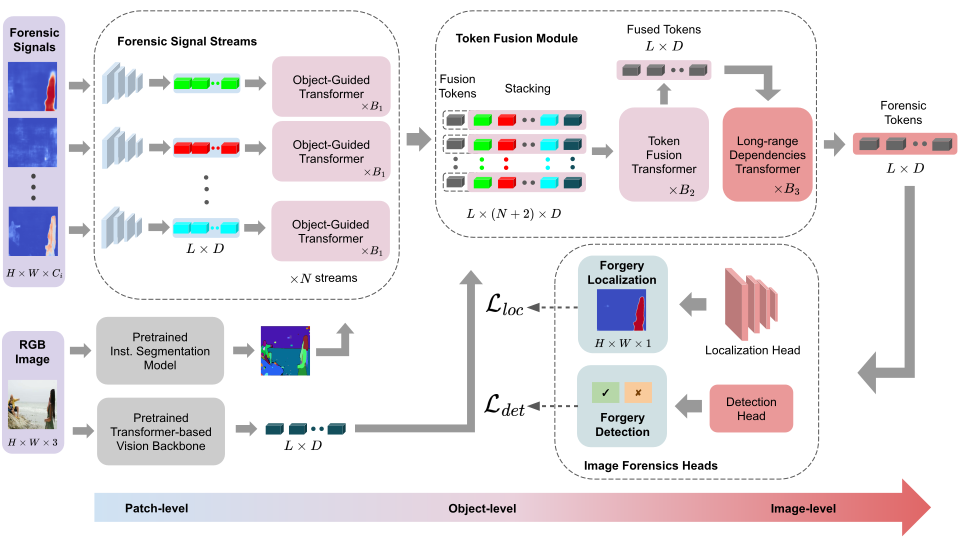

# OMG-Fuser
Official code repository for the paper __[Fusion Transformer with Object Mask Guidance for Image Forgery Analysis](https://openaccess.thecvf.com/content/CVPR2024W/WMF/html/Karageorgiou_Fusion_Transformer_with_Object_Mask_Guidance_for_Image_Forgery_Analysis_CVPRW_2024_paper.html)__.

OMG-Fuser is a transformer-based fusion network
designed to extract information from various forensic signals
to enable robust image forgery detection and localization.
It can operate with an arbitrary number of forensic signals and leverages object information for their analysis.



## :hammer: Setup

The best way to install OMG-Fuser is through an Anaconda environment, as following:
```shell
conda create -n omgfuser python=3.10
conda activate omgfuser
conda install pytorch==1.13.1 torchvision==0.14.1 torchaudio==0.13.1 pytorch-cuda=11.7 -c pytorch -c nvidia
pip install -r requirements.txt
```

CUDA-enabled GPUs are required to run the code. The code originally targeted HPC nodes
with 4 x Nvidia A100 40GB for training and Nvidia RTX 3090 for inference. However, more
GPUs should be supported.

OMG-Fuser was originally developed to be integrated into a complex distributed system 
consisting of several components for generating the input signals, training the models, 
evaluating and serving them. As we integrate more functionalities under a monolithic 
architecture, we will keep updating this repository.

## :hourglass_flowing_sand: Inference

The score-level fusion variant can be tested using the following cli command: 

```bash
python -m omgfuser test \
  --experiment_name omgfuser_score_fusion \
  --gpu_id 0 \
  --checkpoint_path ./checkpoints/omgfuser_score_fusion.pth \
  --dataset_csv ./data/[test_csv_name] \
  --model_name "masked_attention_positional_fusion_double_conv_upscaler_transformer_single_mlp_detector_dinov2frozen_feat_int_drop_stream_drop_path_5_inputs" \
  --input_signals "image,span,mvssnetplus,ifosn,catnetv2,trufor,sam_raw" \
  --signals_channels "3,1,1,1,1,1,0" \
  --loss_function "class_aware_localization_detection_bce_dice"
```

The feature-level fusion variant can be tested using the following cli command:

```bash
python -m omgfuser test \
  --experiment_name omgfuser_score_fusion \
  --gpu_id 0 \
  --checkpoint_path ./checkpoints/omgfuser_feature_fusion.pth \
  --dataset_csv ./data/[test_csv_name] \
  --model_name "masked_attention_positional_fusion_double_conv_upscaler_transformer_single_mlp_detector_dinov2patchembedfrozen_feat_int_bilinear_drop_stream_drop_path_2_inputs_448" \
  --input_signals "image,npp,dct,sam_raw" \
  --signals_channels "3,1,2,0" \
  --loss_function "class_aware_localization_detection_bce_dice"
```

## :paperclip: License

```
Copyright 2024 Media Analysis, Verification and Retrieval Group -
Information Technologies Institute - Centre for Research and Technology Hellas

The code included in this repository is licensed under the 
Apache License, Version 2.0. A copy of the license can be found in 
the LICENSE file.

Unless required by applicable law or agreed to in writing, software
distributed under this repository is distributed on an "AS IS" BASIS,
WITHOUT WARRANTIES OR CONDITIONS OF ANY KIND, either express or implied.
See the license for the specific language governing permissions and
limitations under the License.
```

## :scroll: Citation

When using any content included in this repository, the following paper should be cited.   

```
@inproceedings{karageorgiou2024fusion,
  title={Fusion Transformer with Object Mask Guidance for Image Forgery Analysis},
  author={Karageorgiou, Dimitrios and Kordopatis-Zilos, Giorgos and Papadopoulos, Symeon},
  booktitle={Proceedings of the IEEE/CVF Conference on Computer Vision and Pattern Recognition},
  pages={4345--4355},
  year={2024}
}
```

This work was supported by the Horizon Europe [vera.ai](https://www.veraai.eu/home) project (grant no.101070093), 
Junior Star GACR (grant no. GM 21-28830M), and EuroHPC for providing access to
MeluXina supercomputer (grant no. EHPC-DEV-2023D03-008).

## :mailbox: Contact

For any question regarding this project you may contact dkarageo@iti.gr 